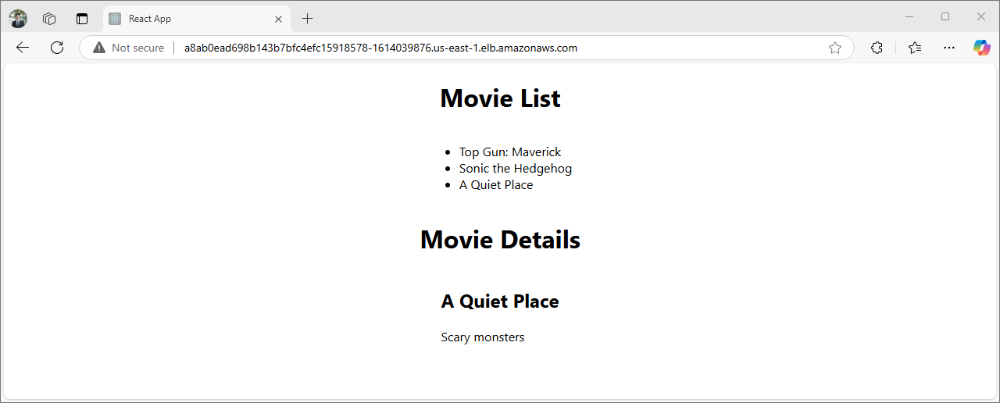

# Project 4: Movie Picture Pipeline
# Huy Nguyen Quang

## Project Instructions
1. Create an IAM user and attach the following policies: AdministratorAccess, AmazonEC2ContainerRegistryReadOnly, AmazonEKS_CNI_Policy, AmazonEKSWorkerNodePolicy
2. Use the created IAM user to conect to AWS
  ```bash
  aws configure
  aws configure set aws_session_token [SESSION_TOKEN]
  ```
3. Use terraform to setup
  ```bash
  git clone https://github.com/tfutils/tfenv.git ~/.tfenv
  export PATH="$HOME/.tfenv/bin:$PATH"
  source ~/.bashrc
  tfenv install 1.3.9
  tfenv use 1.3.9
  cd /workspace/setup/terraform
  terraform init
  terraform apply
  ```
4. Generate AWS access keys for GitHub Actions (`github-action-user` iam user) then store them in Github Secrets
5. Add Github Action user to Kubernetes
  ```bash
  cd setup; ./init.sh
  ```
6. After the application deploy successfully, we can get the external-ip by run `kubectl get service -A`

  

  In my case, I can use my browser to check: http://a8ab0ead698b143b7bfc4efc15918578-1614039876.us-east-1.elb.amazonaws.com
  

## Deliverables
1. README.md: `README.md`
2. Workflows: `.github/workflows/*`
2. Screenshots: `./sceenshoots/*`
3. GitHub URL: https://github.com/huynq8494/aws-ci

## Notes
1. I got "Unauthorized" error when run setup/init.sh even I already configure aws, update kubeconfig. Finally, I realize that, it came from my user in IAM don't have permision to update the cluster config. I tried to allow "eks:UpdateClusterConfig" action on my IAM user, but it was out of date. I remembered that I already configured this in the previous course, then I attached AmazonEC2ContainerRegistryReadOnly, AmazonEKS_CNI_Policy, AmazonEKSWorkerNodePolicy to my IAM user. Finally, it works well with this way.
2. I got crashing when run `terraform apply` -> I need to got to Cloud Console to manual delete resource before re-run `terraform apply`.
3. In previous courses, I knew how to get LoadBalancer public address. Then I try to get this value in workflow and use this as an agurment for frontend docker build.
4. When I run github action, I got some error, but the logs are very detail and clear, from that logs, I can easier detect the root cause. Disable passed portion help me save alot of time. For example, I got issue in backend CD, I will disable the rest (backend/frontend CI, frontend CI) and also `lint` and `test` jobs.
5. Use `kubectl get pods` to make sure all backend, frontend service are working. In case any service is not working use `kubectl describe pod <pod_name>` to debug.
